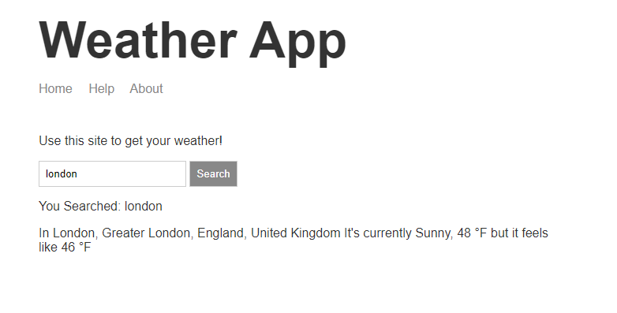

# Full stack app for finding your current weather



## install packages

```javascript
npm install
```

- `e` extensions to monitor


## sign up for mapbox.com account

- place your api key in `.env` in the layout of `.env.template`

## sign up for weatherstack.com account

- place your api key in `.env` in the layout of `.env.template`

## start app locally

```bash
nodemon ./src/server.js -e js,hbs
```